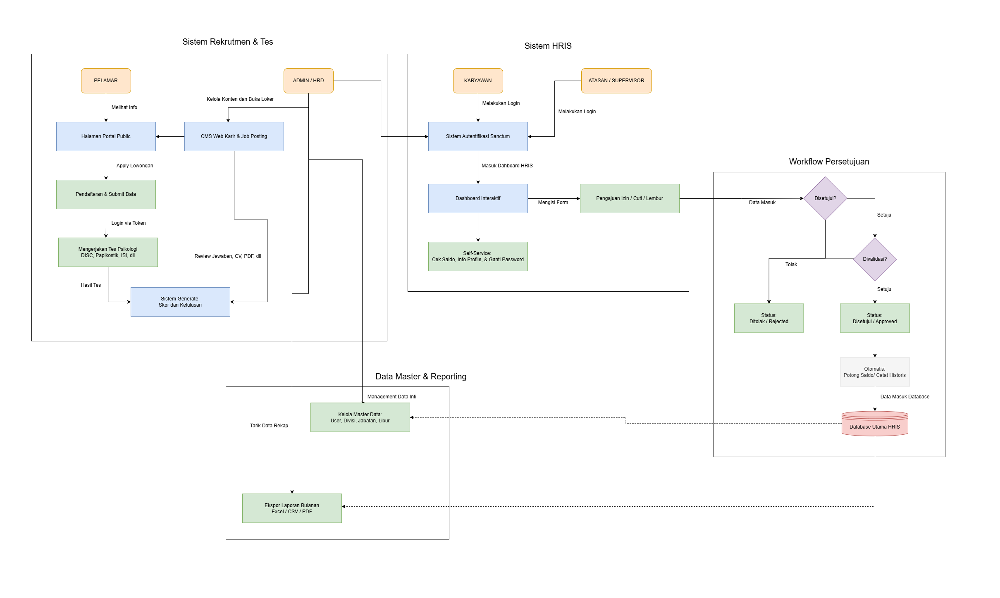

# Project Overview: HRIS & Career Management System

Selamat datang di dokumentasi proyek sistem informasi sumber daya manusia terintegrasi. Proyek ini dikembangkan secara komprehensif sebagai *Fullstack App* guna mendigitalisasi dan menyederhanakan manajemen kepegawaian internal sekaligus proses rekrutmen eksternal perusahaan (khususnya untuk PT. Sinko Prima Alloy).

---

## Flowchart Alur Sistem

Berikut adalah gambaran visual menyeluruh mengenai alur kerja sistem, mulai dari proses rekrutmen publik, manajemen kepegawaian internal, workflow persetujuan berjenjang, hingga pelaporan data HRD.

---

## 1. Latar Belakang (Background)

Perusahaan membutuhkan sebuah sistem terpusat untuk mengatasi permasalahan manajemen sumber daya manusia yang sebelumnya masih dikelola secara manual atau terpisah. Pencatatan izin harian, sisa cuti, rekap lembur, hingga proses pendaftaran calon pegawai baru selama ini membutuhkan waktu *overhead* yang cukup tinggi. Oleh karena itu, dibangunlah **HRIS & Career Management System** sebagai solusi sentralisasi *database* dengan kapabilitas persetujuan berjenjang (otomatisasi *workflow*) dan manajemen konten rekrutmen *(web public).*

## 2. Fitur & Fungsionalitas Utama

Proyek ini bertujuan menangani masalah kompleks melalui 4 pilar fitur berikut:

### a) Kedisiplinan Mandiri (Employee Self-Service)
Aplikasi memfasilitasi karyawan untuk mengurus kewajiban administrasinya secara mandiri dari layar mereka:
*   Memonitor langsung sisa *balance* (saldo) cuti, baik cuti tahunan maupun cuti pengganti hari libur.
*   Mengajukan secara online berbagai form absensi seperti Izin Terlambat, Sakit, atau Cuti.
*   Menjadwalkan dan mencatatkan riwayat lembur (*Overtime*).

### b) Persetujuan Berjenjang (Hierarchical Approval)
Setiap pengajuan yang diinisiasi oleh karyawan harus melewati proses persetujuan elektronik berjenjang agar terkontrol:
*   Atasan/Manager memiliki hak untuk meninjau detail hingga melakukan persetujuan (Approve) atau Penolakan (Reject) dari karyawan di bawahnya.
*   HRD melakukan validasi akhir setelah disetujui atasan.

### c) Portal Karir (Rekrutmen Eksternal) & CMS
Merupakan fasilitas antarmuka bagi publik (*Public web*) yang memiliki fleksibilitas tinggi:
*   **Content Management System (CMS):** Memungkinkan departemen HR atau admin mengubah teks sambutan (Hero section), *Core Values*, Misi, serta struktur halaman portal tanpa campur tangan *programmer*.
*   **Rekrutmen Terpusat:** Admin dapat memuat (*Posting*) dan menutup lowongan suatu pekerjaan. Sementara pelamar (*Applicant*) dapat memanfaatkan laman ini secara umum untuk mengisi pertanyaan pra-tes dan mendaftar dengan sistem otentikasi token pelamar yang sederhana.

### d) Ekspor Pelaporan Data HRD
Pada siklus bulanan/tahunan (seperti tutup pembukuan atau hitung Payroll), sistem menyediakan fasilitas:
*   *Generate* perhitungan saldo akhir atau perbaruan *massal* saldo *balance* cuti tiap tahunnya.
*   Mengunduh secara otomatis rekap lembur bulanan serta izin (dalam wujud Excel Spreadsheet, CSV maupun cetak PDF).

## 3. Tujuan dan Objektif Proyek

*   **100% *Paperless Administration*:** Menyingkirkan proses fisik dan persetujuan pengajuan form via kertas.
*   **Transparansi Informasi:** Memastikan setiap pihak (karyawan, atasan, dan direksi) meninjau data satu pintu yang sama secara *real-time*.
*   **Peningkatan *Employer Branding*:** Melalui kehadiran eksternal yang kuat (dengan Portal Karir dinamis) yang membantu menarik calon pelamar dengan profil dan kredibilitas modern perusahaan PT. Sinko Prima Alloy.
